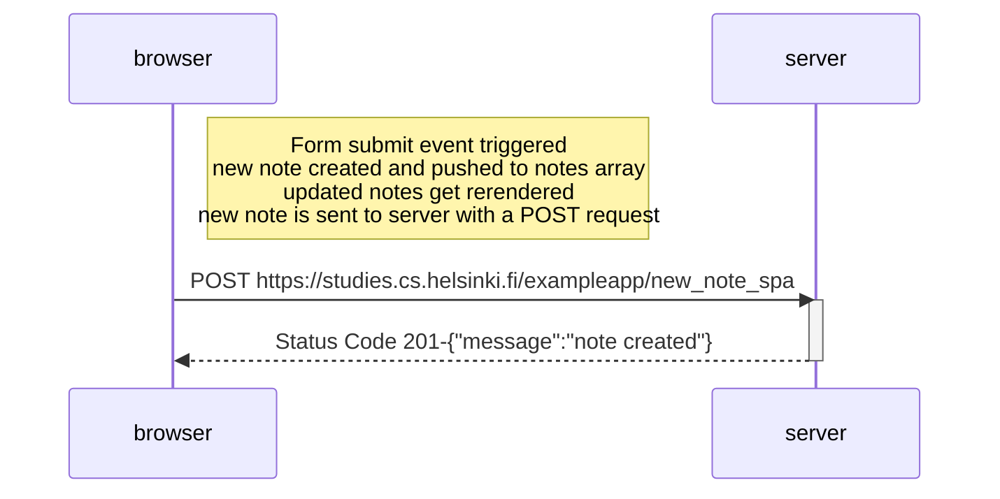

```mermaid
sequenceDiagram
    participant browser
    participant server
    
    Note right of browser: Form submit event triggered <br/> new note created and pushed to notes array <br/>updated notes get rerendered <br/>new note is sent to server with a POST request
    
    browser->>server: POST https://studies.cs.helsinki.fi/exampleapp/new_note_spa
    activate server
    server-->>browser: Status Code 201-{"message":"note created"}
    deactivate server

```
